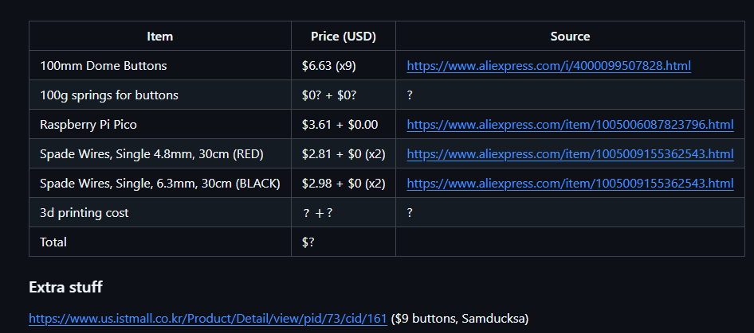
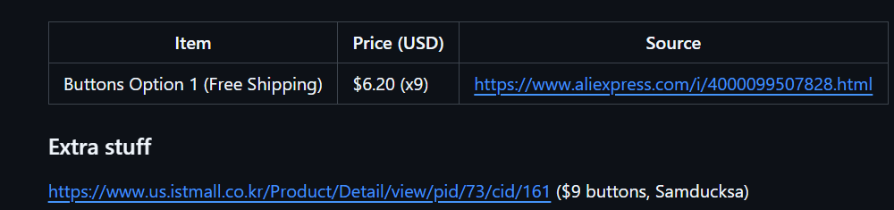
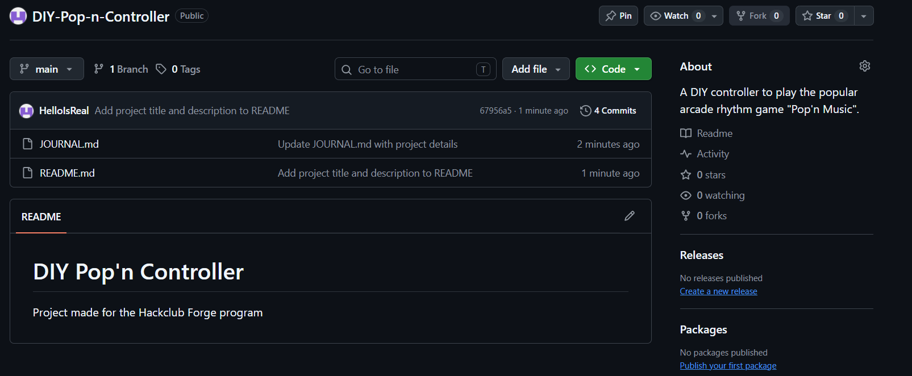

# August 16: Research into parts, next step is case

I'm gonna be honest, I've been spending WAY too much time researching parts.
This is supposed to be a simple couple buttons, hooked onto a microcontroller, then connected to firmware and boom.
I guess this is what happens when you make something like this as your first hardware project lol. Anyway no more ranting

Since the last journal entry, I've added the prices and other parts I'll need for this controller. The first one mainly being the microcontroller.
I spent an unnecessary amount of time researching microcontrollers, and I eventually ended up on the "Raspberry Pi Pico", or the board also known as RP2040.
The original Raspberry Pi Pico board seems like a bit of a hassle to get.
So I instead chose a clone of it (technically it may be real, but who knows), which is also cheaper as a positive.
I also took quite a while on researching how to connect stuff to it without solder, which now I'm just gonna get a soldering kit instead of round about ways.

Next are the wires. I was still looking at getting wires without having to solder at all, so I took my time researching spade clips, connectors and wires.
The part that took the most time was finding if the wire could connect to the Pi Pico easily without solder 😭. This is when I've decided I'll just get a soldering kit.
After also researching a bit on the switch, I found I needed 4.8mm wires, and 6.3mm wires. So I looked into it and found red 4.8mm 30cm wires, and black 6.3mm 30cm wires.
The exposed wire part I'll just solder right onto the Pi Pico. I asked and was told that it's simpler that way 😄 (unless I find a way to separately connect it)

There is one thing I'm currently unsure about. And that's with the springs for the buttons.
The buttons supposedly come with 500/600g springs, and that's WAY too much force to press the button.
I've tried my best to look for some 100g springs. But all I can find are 100g Sanwa springs, which I'm unsure will work, but will have to do 🤔

I've probably spent like 6 hours researching just parts, but I think that's an absurd amount of time for just research 😭

**Total time spent: 3 hours**

# August 14: BOM started, need to make a case

Looking at what I need to do next. I realized that I would need a part materials list.
Mainly in order to build the controller, but also to know what components I actually need to build this controller

I was also planning on using a case that was already perfect for this. But apparently I need to make the case myself too 😭
I'll have to learn how to use a 3d software in order to make a case 🙏

I spent about half an hour researching buttons, and the cheapest one I found were from Aliexpress.
Though I'd love to use some blue spring buttons for the extra ~$3 USD per button. Heard they're good.

I'm also going to hopefully be using [this guide](https://github.com/CrazyRedMachine/UltimatePopnController) in order to make the controller function.

**Total time spent: 0.5 hours**

# August 13: Created the Github

Created the github earlier, created the journal to sync to the Hackclub forge page.
My first steps from here is to figure out all of the components, and the steps I'll take in order to make the Pop'n Controller

